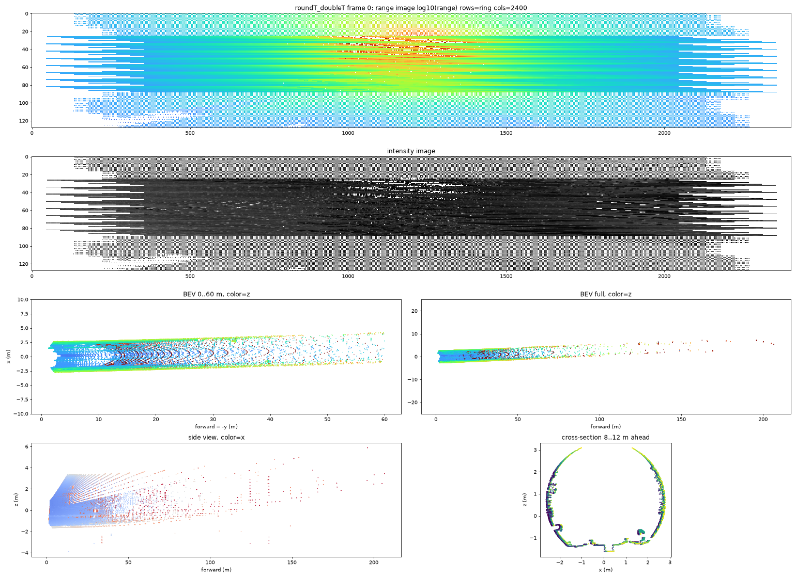
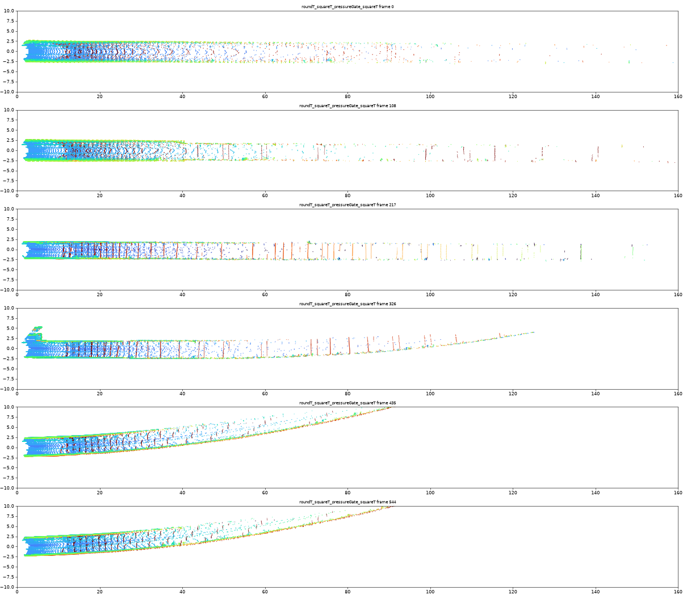
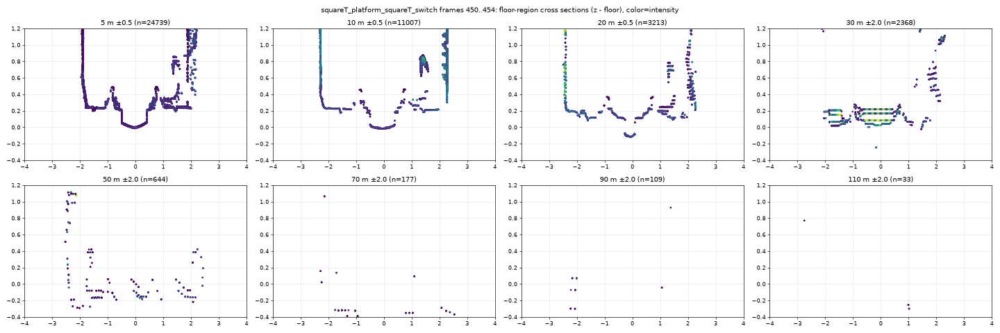
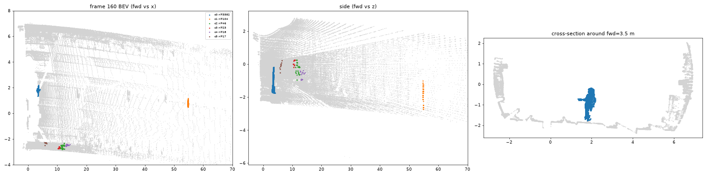

# Анализ задания и данных — ЛЦТ 2026, кейс «Московский транспорт»

**Система обнаружения посторонних объектов для беспилотных поездов в тоннеле метро по данным 3D‑лидара.**

Документ собран по трём источникам из `Исходные данные/`: `Техническое задание.pdf`, `Ответы на вопросы.docx` и `датасет.zip`.
Числа в разделах 3–9 получены скриптами из `research/eda/`, графики лежат в `docs/img/`.

---

## 1. Суть задачи

| | |
|---|---|
| **Вход** | поток `sensor_msgs/PointCloud2` из ROS 2 bag |
| **Выход (минимум)** | «препятствие есть / нет» и расстояние до ближайшего |
| **Выход (плюс)** | положение, размеры, тип, уверенность |
| **Среда (обязательно)** | Ubuntu 22.04, ROS 2 Humble, Docker; зависимости ставятся при сборке образа |
| **Стенд проверки** | i7‑9700E (8 ядер, без HT), 128 ГБ RAM, RTX 4070 Ti SUPER, Ubuntu 22.04.5 |
| **Сценарий запуска** | `docker build → docker run → ros2 bag play → видим результат` |
| **Демо** | контейнер → проигрывание бэга → облако → детекция → расстояние (RViz2 или аналог) |

**Что сдавать.**
- *Промежуточно:* Dockerfile/образ, рабочий прототип, краткое описание подхода, минимальное демо, первые эксперименты.
- *Финально:* контейнер, исходники, README (описание, сборка, запуск, обработка бэга, параметры), архитектура, описание алгоритма (какую проблему решает, данные, обработка, решающее правило, параметры, ограничения, мат. модель), эксперименты (дальность, задержка, FPS, ложные срабатывания, сложные ситуации, динамика качества), видео, демо на **контрольном бэге, которого у нас нет**.

**Критерии (в порядке веса).**
1. **Работоспособность:** пропуски, ложные срабатывания, устойчивость на разных участках, работа на новых данных.
2. **Дальность:** условно 300 м — отлично, 200 м — очень хорошо, 100 м — хорошо; оценивается в балансе с надёжностью.
3. **Скорость:** задержка, частота, CPU/GPU, стабильность в реальном времени.
4. **Обобщаемость:** плюс за использование особенностей самого тоннеля, а не запоминание объектов.
5. **Техническая проработка:** архитектура, код, тесты, воспроизводимость, документация.
6. Простота запуска, подход команды (гипотезы, неудачи, компромиссы), питч (вес меньше).

**Ответы организаторов.** Датасет с препятствиями собрать сложно. Дополнительные данные будут, но в основном пустые тоннели. Предложены три пути:
1. Сеть, обученная на пустых тоннелях, ищет отклонения без классификации.
2. Классификация с самостоятельно сгенерированными синтетическими препятствиями.
3. Классические геометрические алгоритмы.

---

## 2. Датасет

Архив: `датасет.zip` (3.9 ГБ) → `for_hackathon.zst` (tar+zstd) → 6 бэгов, **22 ГБ**, формат sqlite3 (`.db3`), по одному топику в каждом.
Распакован в `data/for_hackathon/`.

| Бэг | Длит. | Кадров | Топик / frame_id | Точек в кадре (валидных) | Поле зрения | Поезд | Что в сцене |
|---|---|---|---|---|---|---|---|
| `doubleT_obstacle` | 20.4 с | 201 | `/sensing/lidar/hesai128/pointcloud` / `lidar_livox` | 921 600 (~347 тыс.) | 360° (данные в ±122°) | **стоит** | двухпутный прямой тоннель, **2 человека** |
| `doubleT_platform` | 34.4 с | 345 | `/lidar_points` / `hesai_lidar` | 307 200 (160–186 тыс.) | ±50° | тормозит с ~54 км/ч до остановки | двухпутный, станция, кривая |
| `roundT_doubleT` | 25.1 с | 252 | то же | 307 200 (~190 тыс.) | ±50° | едет | круглый → камера перехода → двухпутный |
| `roundT_pressureGate_roundT` | 26.7 с | 268 | то же | 307 200 (~190 тыс.) | ±50° | едет | круглый, гермозатвор, S‑кривая |
| `roundT_squareT_pressureGate_squareT` | 55.4 с | 545 | то же | 307 200 (~185 тыс.) | ±50° | едет | круглый → прямоугольный, гермозатвор, кривая |
| `squareT_platform_squareT_switch` | 88.2 с | 877 | то же | 307 200 (160–190 тыс.) | ±50° | прибывает, стоит ~35 с, разгоняется до ~42 км/ч | прямоугольный, станция, стрелка/развилка |

Всего ~4.2 минуты записи, 2488 кадров. Кадры с препятствиями есть только в одном бэге (201 кадр, поезд неподвижен). Записи сделаны 2026‑09‑02 примерно с 16:10 до 17:35 МСК.

---

## 3. Формат данных и сенсор

### 3.1 PointCloud2
- Поля: `x, y, z, intensity` (float32), `ring` (uint16), `timestamp` (float64, секунды). 26 байт на точку, little‑endian, `height=1`.
- **Облако на деле организовано.** Точки идут колонками по 128 лучей (`ring = 0..127` по порядку), поэтому `reshape(-1, 128)` без потерь даёт range‑image размером *колонки × 128*. У всех точек одной колонки общий `timestamp`.
- **Нет отражения — нули, а не NaN** (при этом `is_dense=False`). Валидных точек ~38% в 360°‑бэге и 52–62% в остальных.
- **Режим dual return.** Соседние колонки `2k` и `2k+1` имеют одинаковый азимут. У 97–99% пар дальности совпадают, у 1–3% отличаются (края объектов, кабели, полупрозрачные преграды).
- **Азимутальный шаг 0.1°** у центральных лучей (заполнена каждая пара колонок) и 0.2° у периферийных (каждая вторая).
- Колонок: 7200 на 360° (0.1 с) в `doubleT_obstacle`; 2400 на 120° (1/30 с) в остальных, из них заполнены только ±50°.
- Минимальная дальность: 0.3 м в `doubleT_obstacle`, **~1.9–2 м** в остальных (похоже на отсечку драйвера).

### 3.2 Время
- `header.stamp` ≈ **2000‑01‑01**: часы лидара не синхронизированы. Время записи в бэге — 2026‑09‑02.
- Шаг `header.stamp` — 100 мс, но **кадры теряются**: 0.2 и 0.4 с (`doubleT_obstacle`), 1.1 с (`roundT_squareT_pressureGate_squareT`), 0.7 с (`squareT_platform_squareT_switch`).
- Практический вывод: задержку мерить по wall‑clock внутри узла, от `header.stamp` не зависеть. `/tf` в бэгах нет; в RViz2 fixed frame = frame_id облака, для остальных фреймов — только static TF.

### 3.3 Сенсор — **Hesai Pandar128E3X** (подтверждено)
Сенсор мы определили по данным, а 2026‑09‑16 организаторы дали ссылку на документацию
([hesaitech.com/downloads → Pandar128](https://www.hesaitech.com/downloads/#pandar128)). Сверка паспорта с измерениями
по бэгу `doubleT_obstacle`, кадр 60 (`research/eda/`, скрипт проверки — `tools/sensor_check.py`):

| Параметр | Паспорт Pandar128E3X | Измерено в данных |
|---|---|---|
| Каналов | 128 | 128 (`ring` 0…127, все присутствуют) |
| Поле зрения по вертикали | 40° | **39.52°**: +14.40° … −25.12° |
| Разрешение по вертикали | 0.125° (каналы 26…90) | **0.122°** (медиана) в кольцах 25…88, вне полосы **0.487°** |
| Поле зрения по горизонтали | 360° | 360° (в `/lidar_points` заполнен сектор ±50°) |
| Разрешение по горизонтали @10 Гц | 0.1° | **0.1000°** ровно — в тех же кольцах 25…88; в остальных **0.200°** |
| Частота точек, single return | 3 456 000 /с | 64·3600 + 64·1800 = 345 600 точек/оборот × 10 Гц = **3 456 000** ✔ |
| Частота точек, dual return | 6 912 000 /с | 921 600 точек в кадре = 2 возврата на луч (совпадение азимутов 2.00) ✔ |
| Дальность | 200 м при 10% отражения | максимум возвратов в записях **196…207 м** |
| Минимальная дальность | 0.3 м | 0.3 м в `doubleT_obstacle`, ~1.9 м в остальных (отсечка драйвера) |

Главный вывод для алгоритма — **сенсор состоит из двух половин**:
- **64 «плотных» канала, кольца 25…88, углы места +1.97° … −6.07°**, сетка 0.1° × 0.122°;
- **64 «редких» канала** (верх и низ), сетка 0.2° × 0.487° — вчетверо реже по вертикали и вдвое по горизонту.

При высоте лидара 1.33 м (1.73 м в `doubleT_obstacle`) путь уходит ниже −6.07° только ближе **12.5 м** (16 м),
поэтому **всё, что дальше ~16 м, видно плотной половиной сенсора** — а именно там и решается задача дальнего
обнаружения. Модель плотности в детекторе (`azimuth_resolution_deg = 0.1`, `elevation_resolution_deg = 0.125`)
описывает ровно эту зону и потому корректна на всём рабочем диапазоне; на 8…16 м она завышает ожидаемое число
лучей, но там объект даёт сотни точек и порог разреженности не связывает (проверено набором сценариев `near`,
§ experiments).
- **Таблица углов одинакова во всех бэгах** — её можно хранить как калибровку или оценивать на лету.
- **300 м на этом сенсоре недостижимы в принципе:** паспортные 200 м даны при 10% отражения, точек дальше 200 м в
  записях — единицы на кадр.

### 3.4 Система координат и поза лидара
- **Вперёд = −Y, влево = +X, вверх = +Z.** Проверка: в двухпутном тоннеле соседний путь слева, что соответствует правостороннему движению.
- Поза относительно плоскости путевого бетона (RANSAC по полу 3–15 м):

| Бэг | Высота | Тангаж | Крен |
|---|---|---|---|
| `doubleT_obstacle` | **1.73 м** | +0.85° | **+2.6°** |
| остальные 5 | 1.33–1.34 м | ≈ +0.2° | ≈ 0° (до ±2.6° на кривых) |

→ **Крепление лидара отличается между записями**, в контрольном бэге может быть третий вариант. Поэтому нужна автокалибровка высоты, тангажа и крена по полу, а не константы в коде.
→ Топик и frame_id тоже различаются: узел должен брать топик из параметра или находить PointCloud2 сам.
- В `doubleT_obstacle` ось пути смещена на ~0.3 м вправо от лидара (по водоотводному лотку и рельсам), в остальных лидар примерно на оси.

---

## 4. Что видно в сценах

- **Типы тоннелей:**
  - круглый Ø≈5.6 м;
  - прямоугольный однопутный ≈4.2 × 4.4 м;
  - двухпутный прямоугольный ≈9 × 4.5–5 м.
- **Кривые почти в каждом бэге.** В повороте линия визирования упирается во внешнюю стену через ~90–150 м.
  - 99.9‑й перцентиль дальности в плотной зоне: медиана по бэгам 121–155 м, минимумы 86–121 м.
  - **Коридор движения должен повторять изгиб пути**; прямой «ящик» на кривой упрётся в стену и даст ложную тревогу.

- **Рельсы надёжно видны только до ~30–40 м.** Дальше лучи идут по полу почти по касательной, и отражений от пути почти нет. Значит, на дальности ось пути и габарит придётся восстанавливать по стенам и своду, а вблизи — по рельсам и водоотводному лотку.

- Вблизи пути много «законной» инфраструктуры: контактный рельс, лоток, кабели, кронштейны, светильники, сигналы.
- **Потенциальные источники ложных срабатываний:**
  - портал гермозатвора (издалека, ~100 м, выглядит как конструкция поперёк тоннеля);
  - край платформы и объём станции;
  - стрелка и расходящийся тоннель;
  - камеры перехода между типами тоннеля;
  - «призрачные» точки ниже пола на дальности (переотражения).

---

## 5. Сценарий с препятствием (`doubleT_obstacle`)

Поезд **неподвижен** все 20 с: медианное изменение дальности между кадрами 4–8 мм, то есть шум. Фон взят как медиана по кадрам, передний план — всё, что заметно ближе фона; дальше 3D‑кластеризация. Результат — **два человека:**

| | Где | Поведение | Точек |
|---|---|---|---|
| **Человек A** | ~55–57 м впереди | 0–13 с ходит поперёк пути (x от +0.2 до −1.9 и обратно до +1.1 м), затем стоит в точке (0.8 м влево, 54.8 м); рост ~1.7 м | ~100 (с dual return), в отдельные моменты 11–30 |
| **Человек B** | рядом с вагоном → вперёд | появляется на 13.8 с у кабины (~2 м левее лидара), уходит вперёд по междупутью, разгоняясь до ~3 м/с; к концу записи на 16 м | 4200 на 2 м → 1070 на 16 м |

- A большую часть времени **внутри габарита** (≈1.1 м от оси пути). B идёт **у границы габарита / в междупутье** (≈2.2–2.5 м от оси). Это хороший пограничный случай для настройки ширины опасной зоны.
- Число точек на человеке падает ≈ 1/d² (1070 на 16 м → ~100 на 55 м).
- Разметки (ground truth) нет. Траектории выше — готовая основа для ручной разметки этого бэга (`research/eda/obstacle_clusters.py`).
- Сценария «поезд едет, впереди препятствие» в данных **нет** — его придётся синтезировать.

---

## 6. Физический предел дальности

Геометрическое число лучей на цели в плотной зоне (0.1° × 0.125°):

| Дистанция | Человек 0.5 × 1.7 м | Ящик 1 × 1 м |
|---|---|---|
| 50 м | ~89 | ~105 |
| 100 м | ~22 | ~26 |
| 150 м | ~10 | ~12 |
| 200 м | ~5–6 | ~6–7 |

- **Реально отражается ~60% лучей:** на человеке A на 55 м ~50 уникальных отражений против ~90 теоретических.
- Для человека это **~12 точек на 100 м, ~6 на 150 м, ~3 на 200 м** (dual return даёт ×2, но не новую информацию).
- **Уверенно** человека можно видеть примерно до **100–120 м**. 150 м — с накоплением по кадрам и строгой моделью шума. **200 м** реально только для крупных и светлых объектов. **300 м — нет** (предел сенсора ~200 м).
- Для контекста: тормозной путь поезда с 80 км/ч при ~1 м/с² — около 250 м. Отсюда желание заказчика видеть 300 м.
- На кривых предел задаёт геометрия тоннеля (~90–150 м в данных), а не сенсор.

---

## 7. Шум и ложные срабатывания (первичная оценка)

Проверка на пустой стоянке `squareT_platform_squareT_switch` (130 кадров, людей нет), наивное вычитание медианного фона:
- ~**150 пикселей переднего плана на кадр**, **1–2 кластера ≥ 8 точек в каждом кадре**, крупнейший до **60 точек**. Это **сопоставимо с человеком на 55 м**.
- 1.3% лучей «мерцают» (то есть отражение, то нет).
- Dual return расходится в 1–3% пар — смешанные пиксели на краях.

→ Одного кадра и простого порога мало. Нужны:
- гейтинг по габариту;
- минимальный размер кластера, зависящий от дальности;
- подтверждение во времени (M из N кадров, трекинг);
- фильтрация смешанных пикселей.

---

## 8. Скорость поезда в записях

Скорость оценивалась поиском продольного сдвига между кадрами k и k+2, максимизирующего долю совпавших точек (`research/eda/ego_speed.py`).

- **Скорости до ~15–16.5 м/с (54–60 км/ч)**, крейсерская ≈ 15 м/с.
- `doubleT_platform`: **плавное торможение на станцию** с ~15 м/с до остановки за ~25 с (≈ 0.6 м/с²), затем стоянка ~8 с.
- `squareT_platform_squareT_switch`: торможение с ~11 м/с до нуля (≈ 0.67 м/с²), **стоянка ~35 с**, затем **разгон** до ~11.7 м/с (≈ 0.6 м/с²).
- `doubleT_obstacle`: стоит (|v| < 0.1 м/с).

**Важная находка — вырождение регистрации вдоль тоннеля.** В круглых и однородных участках оценка скачет между ~15 м/с и ~0.
Скачок 0.2 → 14.9 м/с за 0.6 с означает ~25 м/с², что для поезда невозможно. Значит, нули — сбой: сдвиг вдоль оси однородного тоннеля геометрически не наблюдается, а совпадение «привязанного к сенсору» рисунка сканирования тянет решение к нулю.
Та же причина у малого попиксельного изменения дальности на ходу: луч, падающий на стену однородного тоннеля, почти не меняет длину.

Следствия:
- Для одометрии нужны признаки (кронштейны, светильники, стыки тюбингов, intensity), модель движения с ограничением ускорения (фильтр Калмана) либо внешний источник скорости (в данных его нет).
- Временные методы (п. 11, подход C) и расчёт TTC должны переживать периоды ненаблюдаемой скорости.
- Детектор, который не зависит от собственного движения (проверка габарита по одному кадру), здесь надёжнее.

---

## 9. Производительность

Скелет пайплайна на numpy (декод → range‑image → преобразование + маска коридора → связные компоненты), Ryzen 5 5600:
- 921 600 точек (360°, dual): **~31 мс**;
- 307 200 точек (±50°): **~7 мс**.

Полный алгоритм (коридор, кластеры, трекинг) будет в 3–5 раз тяжелее. Обрезка до переднего сектора и первого отражения сократит 921 тыс. → ~150 тыс. точек. **Python (rclpy + numpy/numba) укладывается в 10 Гц**, C++ даст запас.
- i7‑9700E на стенде в однопотоке примерно на 20–30% медленнее Ryzen 5600.
- Накладные расходы rclpy на сообщения по 24 МБ надо измерить в Docker заранее.

---

## 10. Среда разработки: что мешает прямо сейчас

- Локально: Windows 11 **без WSL, Docker и ROS**. Для разработки нужен WSL2 (Ubuntu 22.04) + Docker. RViz2 работает через WSLg.
- **На диске C: свободно 4.9 ГБ.** Образы Docker/WSL по умолчанию ложатся на C: — их нужно сразу перенести на D:. Образ ROS Humble desktop весит ~3–4 ГБ.
- Бэги 22 ГБ на `/mnt/d` читаются из WSL через 9P медленно. Для real‑time `ros2 bag play` лучше держать их внутри ext4 (VHDX на D:).
- Локальный GPU — **AMD RX 6600 (без CUDA)**, на стенде NVIDIA. Любой GPU‑код не проверить локально, поэтому основной путь должен работать на CPU.
- RAM 16 ГБ: целиком 360°‑бэг в память не грузить.

---

## 11. Варианты подхода

| # | Подход | Плюсы | Минусы | Оценка |
|---|---|---|---|---|
| A | **Геометрический «свободный габарит»:** трубка габарита вдоль оси пути, проверка лучей range‑image на отражения внутри неё | не нужны обучающие данные; объяснимо; использует специфику тоннеля (п. 8.4); на дальности любое отражение в «пустом» направлении контрастно | качество определяется построением оси и габарита на кривых, станциях, стрелках | **ядро решения** |
| B | Параметрическая модель «нормального тоннеля» (круг/прямоугольник вдоль кривой оси), остатки = аномалии | естественно работает на кривых, даёт ось для A | станции, камеры, порталы ломают параметрическую форму | для построения оси и габарита |
| C | Временной анализ: локальная карта из прошлых кадров + собственное движение, новое/движущееся = аномалия | ловит движущиеся объекты, гасит мерцание | дальние зоны видны впервые; статичное препятствие неотличимо от конструкции | подтверждение и трекинг |
| D | ML‑аномалии: автоэнкодер range‑image на пустых тоннелях (путь 1 организаторов) | учит сложные сцены | ~2.3 тыс. коррелированных кадров из 5 бэгов, другие крепления; дальние цели — единицы пикселей | эксперимент для раздела «что пробовали» |
| E | Детектор с учителем (PointPillars и т.п.) на синтетике (путь 2) | тип объекта | sim‑to-real разрыв, не видит неизвестные объекты | не как основа |

### Рекомендация: гибрид A + B + C + синтетическая проверка

1. **Вход:** PointCloud2 (топик и формат полей из параметров или автоопределение) → range‑image; обрезка по переднему сектору; учёт dual return.
2. **Автокалибровка** высоты, тангажа и крена по полу вблизи (RANSAC, медленное обновление).
3. **Ось пути и габарит:**
   - вблизи — рельсы и лоток (≤ 30–40 м): смещение, курс, кривизна;
   - дальше — посекционно по стенам и своду, со сглаживанием по дуге (ограничение кривизны; вертикальный профиль тоже);
   - габарит = 3D‑трубка заданной ширины и высоты (параметры по ГОСТ 23961 / конфиг).
4. **Кандидаты:** отражения внутри трубки выше полотна с запасом → кластеризация в range‑image → фильтры (порог числа точек от дистанции, высота, согласованность dual return).
5. **Время:** трекинг, накопление уверенности (M из N / log‑odds), оценка собственной скорости (сдвиг кадров вдоль пути). Тревога = подтверждённое препятствие; выход — дистанция по дуге и TTC.
6. **Выход ROS 2:**
   - флаг и расстояние (`std_msgs`);
   - список препятствий (`vision_msgs/Detection3DArray`);
   - `MarkerArray` для габарита и боксов;
   - облако точек‑нарушителей;
   - метрики задержки и FPS;
   - CSV/JSON‑лог для экспериментов.
7. **Синтетика для оценки:** ray‑casting виртуальных объектов в пустые кадры (направления лучей известны точно).
   - Объекты: шаблон реального человека из `doubleT_obstacle`, ящики, лежащий человек, мелкий мусор.
   - Дистанции 10–200 м, внутри и вне габарита, на прямых и кривых.
   - Метрики: recall(дистанция), максимальная надёжная дальность, ложные тревоги в минуту на пустых бэгах, задержка.
   - Это закрывает раздел «Эксперименты» и даёт регрессионные тесты (п. 8.5).

---

## 12. Риски и вопросы к организаторам

1. **Контрольный бэг:** тот же топик и формат? Крепление как в `doubleT_obstacle` (360°, 1.73 м) или как в остальных (±50°, 1.33 м)?
2. Поезд в контрольном бэге **едет или стоит**? Какие препятствия (люди, предметы, размеры)?
3. **Как измеряется результат:** есть ли разметка, как считают «дистанцию обнаружения» и ложные тревоги? Требуется ли конкретный формат вывода (топик, тип сообщения, лог)?
4. **Что считается «на пути»:** точные размеры габарита? Человек в междупутье (как B) — препятствие?
5. Когда и какого объёма будут дополнительные данные?
6. Сроки промежуточной и финальной сдачи, формат демо (удалённый рабочий стол?).
7. Можно ли считать известной калибровку сенсора (углы лучей, поза) или решение обязано определять её само?

---

## 13. Черновой план работ

0. **Окружение:** WSL2 + Docker на D:, образ ROS 2 Humble, `ros2 bag play` + RViz2 на наших бэгах.
1. **Инструменты данных:** быстрый ридер (есть), разметка `doubleT_obstacle` (траектории людей), генератор синтетических препятствий.
2. **Бейзлайн:** автокалибровка + прямой габарит + кластеры + порог M из N → первые метрики (для промежуточной сдачи).
3. **Габарит на кривых, станциях, стрелках:** ось по рельсам и стенам, вертикальный профиль.
4. **Трекинг, собственная скорость, TTC;** настройка порогов на синтетике (recall ↔ ложные тревоги).
5. **ROS 2‑узел + Docker + launch + RViz2‑конфиг,** один командный запуск; тесты (pytest), README.
6. **Оптимизация задержки, стресс‑тесты** (выпадения кадров, 360° vs ±50°).
7. **Эксперименты, видео, документация по требованиям ТЗ, питч.**
