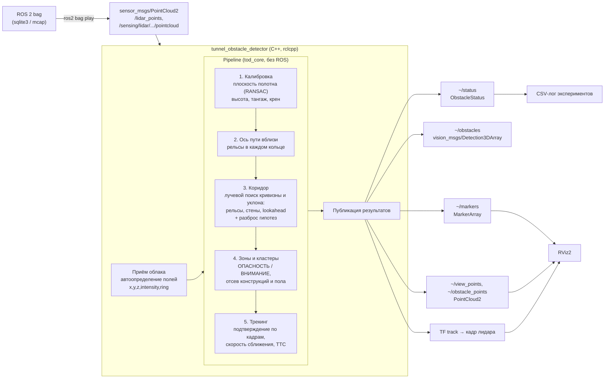

# Архитектура решения

## Цепочка данных

## Компоненты

| Компонент | Где | Назначение |
|---|---|---|
| `tod_core` | `ros2_ws/src/tunnel_obstacle_detector/src/core` | Алгоритм целиком, чистый C++17 + Eigen, без зависимостей от ROS. 27 юнит‑тестов на синтетическом тоннеле (`test/`). |
| `detector_node` | `include/.../ros/detector_node.hpp` + `src/ros/detector_node.cpp` | ROS 2‑узел: подписка на облако (топик из параметра или автопоиск первого PointCloud2), вызов конвейера, публикация результатов. Класс вынесен в заголовок, поэтому сам узел покрыт тестом (`test/test_node.cpp`): облако приходит в топик — из топика выходит вердикт. |
| `offline_runner` | `src/ros/offline_runner.cpp` | Читает бэг напрямую (rosbag2_cpp) быстрее реального времени, пишет JSONL по кадрам и отладочные дампы. Основа экспериментов. |
| `tunnel_obstacle_msgs` | `ros2_ws/src/tunnel_obstacle_msgs` | Сообщения `ObstacleStatus` и `Obstacle`. |
| Инструменты Python | `tools/` | Генератор синтетических препятствий (трассировка лучей в реальные бэги), синтетическая оценка, анализ результатов, отладочные графики. |
| Исследования | `research/` | Разведочный анализ данных и прототипы алгоритма на Python. |

## Системы координат

- **Кадр облака** — как в бэге (`hesai_lidar`, `lidar_livox`, …). Параметр `sensor.forward_axis` задаёт ось, смотрящую вперёд (в данных −Y). Значение `auto` находит её по первым кадрам: вдоль тоннеля вид открыт на 100+ м, назад его закрывает кузов.
- **Без поля `ring`** номер кольца заменяется бином угла места, так что поиск рельсов работает и для драйверов, публикующих только x, y, z.
- **Кадр пути `track`**: X — вперёд вдоль поезда, Y — влево, Z — вверх от плоскости путевого бетона. Строится на лету из калибровки и публикуется как статический TF `track → <кадр облака>`. Поэтому RViz2 работает с любым бэгом без правки конфигурации.

## Выходные данные

| Топик | Тип | Содержимое |
|---|---|---|
| `~/status` | `tunnel_obstacle_msgs/ObstacleStatus` | Уровень CLEAR/WARNING/DANGER, расстояние до ближайшего препятствия вдоль пути, боковое смещение, время до столкновения, уверенность, «путь свободен на X м», список объектов, диагностика (время обработки, задержка передачи, поза лидара, кривизна, захват оси). |
| `~/obstacles` | `vision_msgs/Detection3DArray` | Подтверждённые объекты: 3D‑бокс в кадре облака и класс danger/warning со score. |
| `~/markers` | `visualization_msgs/MarkerArray` | Ось и границы габарита, сечения габарита каждые 25 м, свободный участок пути, боксы и подписи объектов, баннер статуса. |
| `~/view_points` | `PointCloud2` | Прореженное облако с каналом `zone` (0 — вне зон, 1 — ВНИМАНИЕ, 2 — ОПАСНОСТЬ) для RViz2. |
| `~/obstacle_points` | `PointCloud2` | Точки подтверждённых объектов. |

## Время и производительность

- Один кадр обрабатывается в одном потоке колбэка; тяжёлый лучевой поиск распараллелен OpenMP (4 потока, пассивное ожидание).
- `header.stamp` в данных — часы лидара (2000 г.), поэтому узел не опирается на абсолютное время. Задержка передачи меряется по `source_timestamp` DDS, обработки — по стенным часам.
- Очередь подписки `keep_last(2)`: при перегрузке берётся свежий кадр, старые пропускаются.

## Docker

- `docker/Dockerfile`, двухэтапный. Этап **build**: `ros:humble-ros-base` + зависимости, `colcon build` в Release и прогон юнит‑тестов. Этап **runtime**: установленные пакеты + RViz2 + плагины хранилищ бэгов (sqlite3, mcap).
- `docker-compose.yml`: сервисы `detector`, `rviz` и `player` (профиль `demo`); сеть и IPC хоста для DDS.
