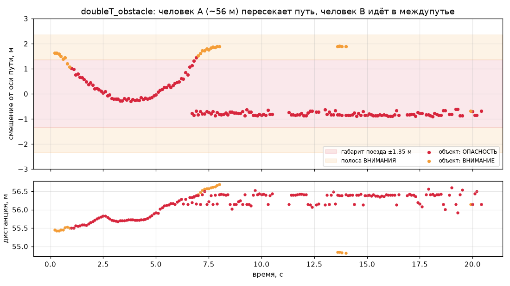
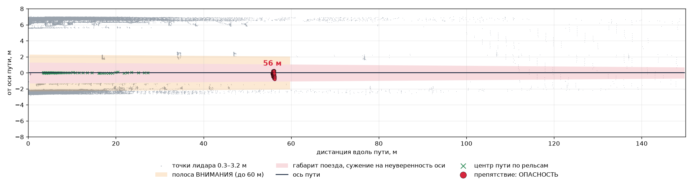
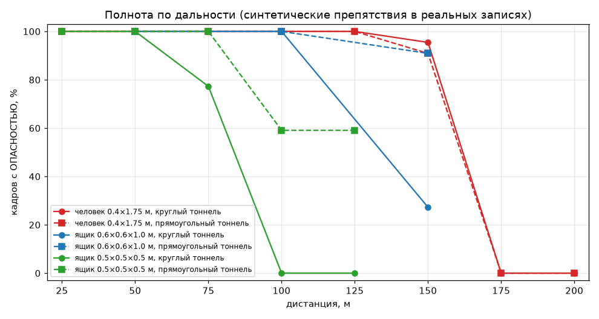
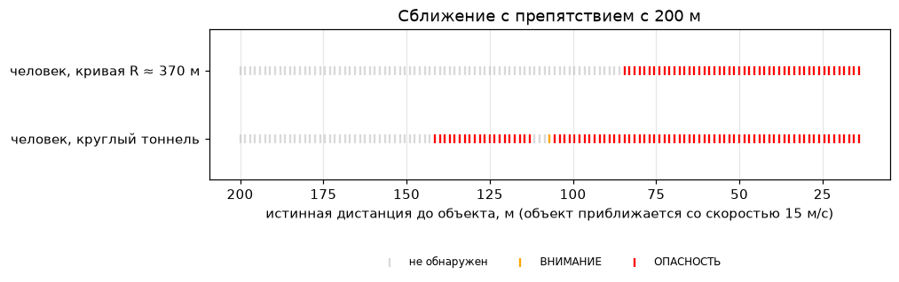
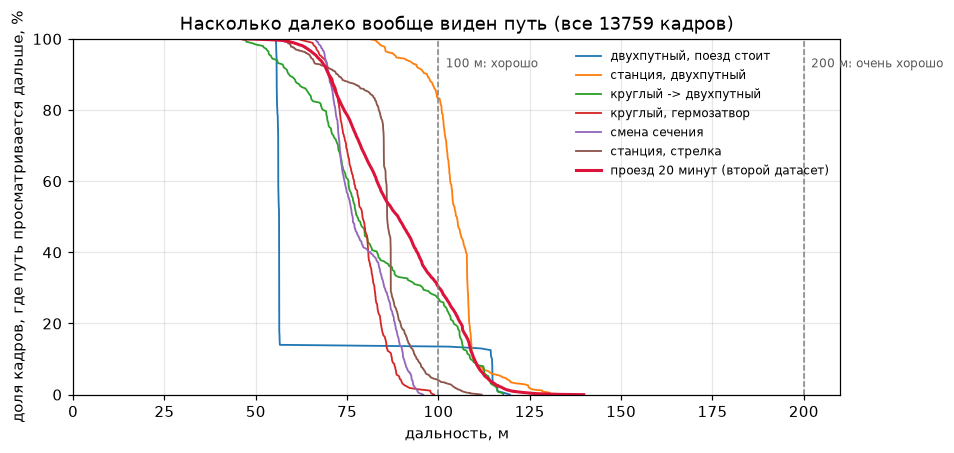
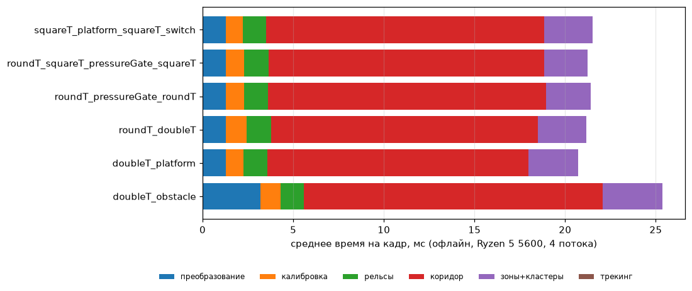

# Эксперименты

Как мы проверяли качество, скорость и обобщение детектора, что получили и что не сработало. Хронология гипотез — в [research_log.md](research_log.md).

## 1. Методика

**Данные.** 6 записей из тоннелей (2488 кадров, 10 Гц): круглые и прямоугольные тоннели, двухпутный тоннель, станции, стрелка, гермозатворы. Настоящие препятствия есть только в `doubleT_obstacle`: два человека, поезд стоит. Остальные 5 записей (2287 кадров) — **пустые**. Любая тревога в них ложная.

**Метрики.**
| что | как меряем |
|---|---|
| Ложные тревоги | доля кадров пустых бэгов с уровнем ОПАСНОСТЬ / ВНИМАНИЕ (после трекинга, как видит оператор) |
| Полнота по дальности | синтетические препятствия в реальных бэгах: доля кадров с подтверждённой ОПАСНОСТЬЮ на правильной дистанции (±max(2 м, 4%)) |
| Дальность обнаружения | препятствие приближается с 200 м на 15 м/с: дистанция первого обнаружения и первой ОПАСНОСТИ |
| Реальные люди | `doubleT_obstacle`: в каких кадрах и на какой дистанции объявлена ОПАСНОСТЬ |
| Скорость | время обработки кадра (офлайн и в живом узле), задержка передачи |

**Синтетические препятствия** (`tools/inject_obstacles.py`). Для каждого луча организованного облака, в том числе пустого, строится направление. Луч трассируется против модели объекта в кадре пути. Если он попадает в объект ближе записанного возврата, возврат подменяется. Вероятность возврата падает с дальностью. Модели: человек (цилиндр 0.4 × 1.75 м), ящики 0.5 × 0.5 × 0.5 м и 0.6 × 0.6 × 1.0 м. Модель человека даёт ~50 точек на 55 м — столько же, сколько настоящий человек в `doubleT_obstacle`.

Объект ставится **относительно оси пути**, а не линии взгляда лидара. Ось берётся из прогона детектора по тому же участку без объекта (медиана по ±5 кадрам). Курс лидара отличается от курса пути на ~0.5°, и на 150 м «прямо по лидару» — это уже 1.3 м от оси, у края габарита. Первая версия оценки этого не учитывала и занижала полноту вдали.

**Воспроизведение.**
```bash
python tools/benchmark.py --tag run1 --baseline final_day2   # ложные тревоги + время, сравнение с прошлой конфигурацией
python tools/sensor_check.py --all              # модель сенсора против паспорта Pandar128E3X
python tools/evaluate_synthetic.py --suite failure  # карта отказов: 40 сценариев на 8 участках
python tools/evaluate_synthetic.py --suite near     # ближняя зона 8…25 м
python tools/evaluate_synthetic.py --suite range    # полнота по дальности 25…200 м
python tools/axis_error.py                      # ошибка оси против пройденного пути
python tools/profile_error.py --results data/results/bench/run1   # ошибка профиля против видимого пола
python tools/evaluate_synthetic.py --suite case     # критерии заказчика: минимальный объект, кабели, 85 км/ч
python tools/evaluate_synthetic.py --suite newgen   # обобщение: тоннели второго датасета
python tools/robustness.py                      # обобщение: 12 изменённых условий съёмки
bash scripts/timing_scaling.sh                  # время кадра по числу потоков (внутри WSL)
python tools/plot_experiments.py                # графики этого документа → docs/img/exp_*.png
```

### 1.1 Проверка модели сенсора по паспорту

Организаторы 2026‑09‑16 дали ссылку на документацию лидара
([hesaitech.com/downloads → Pandar128](https://www.hesaitech.com/downloads/#pandar128)). Вся оценка дальности и
плотности точек опирается на модель сенсора, поэтому мы сверили её с паспортом измерением по самим записям —
`python tools/sensor_check.py --all`:

| Параметр | Паспорт Pandar128E3X | Измерено |
|---|---|---|
| Каналы / поле зрения по вертикали | 128 / 40° | 128 / **39.52°** (+14.40°…−25.12°) |
| Разрешение по вертикали | 0.125° | **0.122°** в плотной полосе, 0.487° вне её |
| Разрешение по горизонтали @10 Гц | 0.1° | **0.100°** в плотной полосе, 0.200° вне её |
| Поток точек, single / dual | 3 456 000 / 6 912 000 в с | **3 456 000** (64·3600 + 64·1800 за оборот) / 2.00 возврата на луч |
| Дальность | 200 м при 10% отражения | максимум возвратов 196…207 м по шести записям |

**7 из 7 проверок совпали.** Практический вывод: сенсор состоит из двух половин — 64 «плотных» канала
(углы места +1.97°…−6.07°, сетка 0.1° × 0.122°) и 64 редких (0.2° × 0.487°). При высоте лидара 1.33 м путь уходит
из плотной полосы только ближе 12.5 м, то есть **вся рабочая дальность снимается плотной половиной**, и заложенные
в детектор 0.1° × 0.125° верны именно там, где решается задача.

Отсюда же появился новый набор сценариев `--suite near` (8…25 м): раньше минимальная проверенная дистанция была
25 м, а в ближней зоне сетка вчетверо реже. Результат — 38 сценариев (человек, лежащий человек, ящик 0.5 м на
четырёх базах), **100% кадров с ОПАСНОСТЬЮ во всех**: на такой дистанции объект даёт сотни точек.

## 2. Ложные тревоги на реальных записях

Итоговая конфигурация (`config/detector.yaml`), уровни после трекинга, одна команда — `python tools/benchmark.py`:

| запись | кадров | CLEAR | ВНИМАНИЕ | ОПАСНОСТЬ |
|---|---|---|---|---|
| `doubleT_platform` — двухпутный тоннель, станция | 345 | 319 | 26 | **0** |
| `roundT_doubleT` — круглый → двухпутный, кривые | 252 | 248 | 4 | **0** |
| `roundT_pressureGate_roundT` — круглый, гермозатвор | 268 | 268 | 0 | **0** |
| `roundT_squareT_pressureGate_squareT` — смена сечений, гермозатвор | 545 | 538 | 5 | **2** |
| `squareT_platform_squareT_switch` — станция, стрелка | 877 | 862 | 15 | **0** |
| **`new_data` — непрерывный проезд 20 минут (второй датасет заказчика)** | **11 271** | 10 893 | 359 | **19** |
| **итого, пустые записи** | **13 558** | | **409 (3.02%)** | **21 (0.15%)** |

Четверть кадров с ВНИМАНИЕМ — цена полосы минимального объекта (§ 5.3): без неё ВНИМАНИЕ 2.20%, ложные ОПАСНОСТИ
те же 0.15%.

Двадцать один кадр из 13 558 — это шесть эпизодов по 2–10 кадров, и каждый разобран по точкам:

- **два кадра** на портале гермозатвора (153 м, высота 2.35 м, 8 точек): ось там подтверждена стенами только до
  76 м, дальше она экстраполирована на 77 м вперёд, и конструкция под сводом попадает в верх габарита;
- **пять эпизодов** в 20‑минутной записи: конструкции под сводом на 103 и 88 м (высота 2.85 и 2.96 м над
  полотном, 16 и 28 точек), два кластера из пяти возвратов на 67–82 м (высота 0.8–1.0 м, смещение 0.3–0.5 м от
  оси) и кластер из шести возвратов на 153–161 м.

Общее у них одно: это не «шум детектора», а реальные конструкции, которые попадают в габарит из-за ошибки оси или
заниженного профиля на дальности. Ни одного ложного объекта **внутри подтверждённого стенами участка** нет.

Семь ложных тревог на станции (100–112 м) убраны в день 3: их причиной был не отбор кластеров, а **вертикальный
профиль**, который нырял на 1.3 м, уводя конструкции впереди из габаритной зоны, — разбор в [журнале](research_log.md).

### 2.1 Второй датасет заказчика: 20 минут непрерывного проезда

2026‑09‑17 заказчик прислал вторую порцию данных — **одну непрерывную запись, 11 271 кадр (20 минут)**, топик
`/lidar_points`, 84 ГБ. Это тот самый «полный проезд тоннеля», на котором они обещали проверять решения, и в ней
впятеро больше кадров, чем во всех прежних записях вместе.

| | |
|---|---|
| время кадра | p50 **23.7 мс**, p95 26.0 мс |
| ось пути захвачена по рельсам | **100% кадров** (тоннели незнакомые) |
| путь просматривается вперёд | медиана 89 м, p10 70 м |
| CLEAR / ВНИМАНИЕ / ОПАСНОСТЬ | 96.6% / 3.2% / **0.17%** |

Каждый из 15 эпизодов ОПАСНОСТИ разобран по точкам — настоящих препятствий в записи нет. До настройки по этим
данным их было 70 кадров, из них 49 — плоские детали пути, поднятые над полом на 0.16–0.25 м (на 11 м это предмет
длиной 2 м и шириной 0.5 м: лоток или жёлоб). Именно они подсказали поднять порог подъёма низкого кластера над
**реально увиденным** полом с 0.20 до 0.26 м — у детали пути подъём 0.20–0.25 м, у лежащего человека 0.35 м, у
предмета на рельсах 0.5 м. Осталось 21.

Важно, что на шести прежних записях эта граница не стоила ничего: таких деталей пути там просто не встречалось.
Новый датасет показал то, чего на старых данных не было видно — и это ровно та проверка обобщения, о которой
говорил заказчик.

```bash
python tools/benchmark.py --tag run1 --new-data     # обе порции данных, 13 558 пустых кадров
python tools/summarize_run.py data/results/new_data.jsonl   # эпизоды тревог на длинной записи
```

## 3. Настоящий человек и предмет на рельсах: `doubleT_obstacle`

Поезд стоит. Человек A на ~56 м заходит на путь, пересекает ось и возвращается к ряду колонн. Человек B идёт в
междупутье в ~2 м от оси. На тех же рельсах лежит предмет — о нём заказчик сказал отдельно: «на рельсах лежит
некий объект там, где стоит человек».



| что сообщается | кадры | дистанция | смещение от оси | высота | возвратов |
|---|---|---|---|---|---|
| человек A внутри габарита | 10–105 (96 кадров) | 55.5–56.5 м | −0.21 м | 1.26 м | 64 |
| предмет на рельсах, после ухода A | 113–200 (77 кадров из 95) | 55.9–56.6 м | −0.80 м | 0.48 м | 6–7 |

**ОПАСНОСТЬ в 173 кадрах из 201** (86%), ВНИМАНИЕ в 9, ложных объектов нет.

- Кадры 2–9 — **ВНИМАНИЕ**: A подходит к пути, его смещение уменьшается с 1.63 до 1.06 м. Как только он входит в
  габарит, уровень становится ОПАСНОСТЬ, и так до кадра 105, пока он не уходит за колонны.
- Человек B (2.1 м от оси) не сообщается: он вне габарита 2.1 м и вне полосы ВНИМАНИЯ вокруг него.
- До 2026‑09‑20 предмет на рельсах сообщался в 31 кадре из 101: он лежит в **0.80 м** от оси, а габарит на 56 м
  сужался на «неуверенность оси» до ±0.776 м. Именно это измерение заставило пересмотреть сужение — разбор
  в [журнале](research_log.md).



*Кадр 30 в координатах найденной оси пути. Сверху дальняя стена двухпутного тоннеля (+6.5 м), колонны между путями (+2 м), снизу ближняя стена (−2.4 м). Габарит сужается с дальностью на неуверенность оси, полоса ВНИМАНИЯ проверяется до 60 м.*

## 4. Ошибка оси пути на реальных записях

Синтетика проверяет обнаружение, но не саму ось. Эталон даёт **пройденный поездом путь**: поезд едет по пути, значит его будущие положения, пересчитанные в текущий кадр, — это и есть ось впереди. Движение восстанавливается по кадрам лидара (`tools/ego_motion.py`): курс — 2D‑совмещением стен, продольное смещение — корреляцией профиля поперечных конструкций (порталы, колонны, кронштейны).

**Проверки эталона.**
- Стоящий поезд — 0.00 м/с; бэг с гермозатвором — 15.0 м/с, что совпало с замером по одиночному ориентиру (−1.50 м за кадр).
- Точки стен, накопленные по траектории за 25 кадров (~37 м), дают толщину стены 6–8 см против 5–6 см в одном кадре: траектория точна до нескольких сантиметров.
- Стена, увиденная издалека, против той же стены вблизи: расхождение 0.05 м на базе 20 м, 0.18 м на 50 м, 0.27 м на 100 м в прямом тоннеле. В круглом тоннеле с S‑кривыми на 100 м — 1.2–1.8 м, поэтому дальше 75 м эталон даёт **верхнюю оценку** ошибки, а не точное значение.

**Ошибка оси** (`tools/axis_error.py`, 5 записей, 1000–1700 кадров на дистанцию):

| дистанция | 10 м | 20 м | 30 м | 50 м | 75 м | 100 м | 125 м | 150 м |
|---|---|---|---|---|---|---|---|---|
| медиана, м | 0.03 | 0.04 | 0.05 | 0.08 | 0.14 | 0.21 | 0.28 | 0.43 |
| p90, м | 0.13 | 0.20 | 0.22 | 0.41 | 0.75 | 1.16 | 1.57 | 2.44 |

- Вблизи (рельсы) — 3–5 см. На 50 м — 8 см.
- Кадров с ошибкой больше 0.5 м: 6% на 50 м, 27% на 100 м, 44% на 150 м.
- На 50 м большие ошибки почти всегда на кривых (|κ| 2.3·10⁻³ против 0.2·10⁻³ в среднем).
- **Где именно.** Худший случай — вход в кривую: видимость падает до 55–70 м, и дальше ось экстраполируется прямее, чем поворачивает путь (в `roundT_doubleT` на кадрах 60–120 ошибка на 150 м доходит до 3–9 м). Там, где тоннель просматривается на 100+ м, медианная ошибка на 100 м — 0.07 м.

**Второй датасет: та же проверка на незнакомых тоннелях.** Четыре отрезка по 102 кадра, вырезанные из 20‑минутного проезда (`tools/cut_parts.py`), по которым ничего не настраивалось. Эталон — тот же пройденный путь, скорость 5–17.6 м/с.

| отрезок | v, м/с | 10 м | 20 м | 30 м | 50 м | 75 м | 100 м | 125 м | 150 м |
|---|---|---|---|---|---|---|---|---|---|
| `new_double` двухпутный | 5.3 | 0.19 | 0.25 | 0.26 | — | — | — | — | — |
| `new_narrow` узкий однопутный | 17.6 | 0.08 | 0.07 | 0.06 | 0.04 | 0.05 | 0.07 | 0.05 | 0.06 |
| `new_curve` кривая R ≈ 300 м | 12.0 | 0.14 | 0.16 | 0.13 | 0.10 | 0.22 | 0.09 | — | — |
| `new_round` прямой, видно 76 м | 16.5 | 0.08 | 0.10 | 0.09 | 0.07 | 0.07 | 0.28 | 0.48 | 0.64 |
| **медиана по всем** | | 0.09 | 0.10 | 0.09 | 0.06 | 0.08 | 0.11 | 0.13 | 0.16 |
| **p90 по всем** | | 0.20 | 0.24 | 0.21 | 0.18 | 0.28 | 0.41 | 0.71 | 0.74 |

Ошибка не выросла: на 100 м медиана 0.11 м против 0.21 м на наших записях. Но и выборка меньше (24–330 кадров на дистанцию против 1000–1700), и кривых в этих отрезках меньше — это проверка «не стало хуже на чужой геометрии», а не более точное измерение. Прочерк стоит там, где поезд не проехал столько вперёд: эталон даёт ось только на длину пройденного пути (48 м у `new_double`, где состав шёл 5 м/с).

**Скорость поезда как побочный продукт.** Чтобы складывать кадры (§ 8, накопление), понадобилось знать, сколько
поезд проехал между ними. Это измеряется по самим данным: продольный профиль поперечных конструкций — порталов,
колонн, кронштейнов, стыков — в полосе ±3 м от оси, поделённый на скользящее среднее, и корреляция с профилем
прошлого кадра (`core/track_advance.hpp`). Проверка против `tools/ego_motion.py` на **2015 кадрах** четырёх
записей: медиана ошибки ±0.01 м, **p90 = 0.06 м, p99 = 0.12 м**, 97% кадров точнее 0.1 м. Накопление в итоге
выключено, а измерение осталось: узел сообщает скорость в строке состояния, в поле `train_speed` и в сводке
прогона — 0 км/ч на записи со стоящим поездом и 46.2 км/ч на `roundT_squareT_pressureGate_squareT`
(эталон: 47 км/ч). Одометрии на этих записях нет, всё считается по одному лидару.

**Знает ли детектор, когда ошибается?** Собственная оценка неуверенности (разброс близких по стоимости гипотез) с настоящей ошибкой **не коррелирует** (коэффициент около нуля на всех дистанциях). Поэтому добавлено честное правило: за пределами дальности, где стены ещё подтверждают ось, габарит сужается втрое быстрее (0.01 м на метр против 0.004).

## 4.1 Ошибка профиля полотна

Ось решает, где габарит поперёк, а **профиль полотна** — где его низ. Ошибка в 0.3 м либо прячет объект, лежащий на
пути, либо поднимает сам пол внутрь габарита. Эталон снова берётся из тех же данных: в каждом интервале дальности
гистограмма высот возвратов у оси имеет отчётливый пик на полотне (лоток и балласт ниже и узкие). Сравнение —
`tools/profile_error.py`.

| дистанция | 20–40 м | 40–60 м | 60–80 м | 80–110 м | 110–150 м |
|---|---|---|---|---|---|
| медиана (оценка − пол), м | −0.03 | −0.04 | −0.01 | −0.03 | −0.23 |
| p90 \|ошибки\|, м | 0.15 | 0.15 | 0.22 | 0.23 | 0.76 |
| доля интервалов, где профиль ниже пола > 0.3 м | 0% | 0% | 1% | **5%** | 36% |

До исправления дня 3 (награда за пол) на 80–110 м было p90 0.41 м и **19%** интервалов с занижением больше 0.3 м —
именно они давали ложные ОПАСНОСТИ на станции. Дальше 110 м профиль остаётся заниженным: там пол виден редко, и
оценка переходит в экстраполяцию уклона; это ограничивает нижнюю полосу (лежащие объекты) дистанцией 75 м.

Отдельная систематическая ошибка — **горизонтальные поверхности рядом с полотном**: головка ходового рельса на
+0.21 м (измерено по данным) и контактный рельс на ~+0.3 м попадают в ту же полосу ±1.35 м. Рельсовые возвраты
сдвигаются на измеренную высоту вниз ближе 60 м (дальше ошибка оси превышает ширину рельсовой полосы). Мерить
профиль только между рельсами (±0.70 м) пробовали — улик становится вдвое меньше, и всё становится хуже.

## 5. Полнота и дальность (синтетика)

Каждый статичный сценарий — 30 кадров, объект на оси пути на заданной дистанции. Две базы: начало `roundT_squareT_pressureGate_squareT` (круглый тоннель) и начало `squareT_platform_squareT_switch` (прямоугольный). Доля кадров с подтверждённой ОПАСНОСТЬЮ на правильной дистанции, первые 8 кадров — прогрев трекера:

| объект | тоннель | 25 м | 50 м | 75 м | 100 м | 125 м | 150 м | 175 м | 200 м |
|---|---|---|---|---|---|---|---|---|---|
| человек 0.4 × 1.75 м | круглый | 100 | 100 | 100 | 100 | 100 | 95 | 0 | 0 |
| человек 0.4 × 1.75 м | прямоугольный | 100 | 100 | 100 | 100 | 100 | 91 | 0 | 0 |
| ящик 0.6 × 0.6 × 1.0 м | круглый | | 100 | | 100 | | 27 | | |
| ящик 0.6 × 0.6 × 1.0 м | прямоугольный | | 100 | | 100 | | 91 | | |
| ящик 1.0 × 1.0 × 1.0 м | круглый | | | | | | 50 | 14 | 0 |
| ящик 1.0 × 1.0 × 1.0 м | прямоугольный | | | | | | 95 | 23 | 0 |
| ящик 0.5 × 0.5 × 0.5 м | круглый | 100 | 100 | 77 | 0 | 0 | | | |
| ящик 0.5 × 0.5 × 0.5 м | прямоугольный | 100 | 100 | 100 | 59 | 59 | | | |
| *возвратов от человека за кадр* | | 526 | 130 | 58 | 28 | 18 | 10 | 6 | 2 |



**Сближение.** Объект приближается с 200 м на 15 м/с (125 кадров). **Первая ОПАСНОСТЬ — на 141 м** в прямом тоннеле и на **85 м** на кривой (там дальше просто не видно). Дальше тревога держится до конца сценария, с одиночными пропусками кадров.



**Боковое смещение.** Заказчик считает препятствием всё, что попадает в габарит шириной 2.1 м, то есть объект
в 1.0 м от оси — препятствие, хотя и на самом краю.

| смещение | 50 м | 75 м | 100 м |
|---|---|---|---|
| 0.6 м | 100% | | 91–100% |
| 1.0 м, тоннели второго датасета | 100% | 50–95% | 0–86% |
| 1.0 м, наши записи (круглый / станция) | | | 23% / 77% |

Разброс на 100 м — это разброс дальности, на которой стены ещё подтверждают ось: за её пределами габарит
сужается вдесятеро быстрее (§ 4, [algorithm.md](algorithm.md)). В `new_curve` на 100 м объект у края габарита
теряется полностью — там кривая R ≈ 300 м и ось подтверждена не дальше 70 м.

- Человек в 2.0 м от оси на 40 м в круглом тоннеле (в 0.3 м от стены) не сообщается: вдали он сливается со стеной в «конструкцию». Это цена отсева оборудования на стенах.

**Ложные объекты в синтетических прогонах:** ни одного в 136 сценариях наборов `range`, `failure`, `case`,
`newgen`; один — в `low` (лежащий человек на 50 м в круглом тоннеле).

**Чувствительность к модели отражения.** Паспорт Pandar128E3X даёт 200 м при 10% отражения, а наша модель
возврата откалибрована по единственной реальной улике — человеку на 55 м — и в дальнем хвосте заведомо
консервативнее. Прогон той же таблицы с паспортной моделью (`--reflect-range 400`) показывает, где это важно:

| дистанция | 100 м | 125 м | 150 м | **175 м** | 200 м |
|---|---|---|---|---|---|
| консервативная модель | 100% | 100% | 95% | **0%** | 0% |
| паспортная модель | 100% | 100% | 95% | **50–82%** | 0% |

До 150 м результат от модели не зависит вообще. На 175 м он определяется отражательной способностью цели: тёмная
одежда ближе к нашей кривой, светлая или сигнальный жилет — к паспортной. На 200 м не хватает уже не энергии, а
лучей: в цель попадают 4–5 лучей, и кластер не проходит подтверждение.

**Что ограничивает дальность.**
- **Физика сенсора.** Число возвратов в последней строке таблицы учитывает оба отражения dual return, различных лучей вдвое меньше. На 175 м в человека попадают 2–3 луча, на 200 м — 1. Кластер из 1–3 точек неотличим от шума: на 130–160 м такие «кластеры» и давали почти все дальние ложные тревоги, поэтому минимальный кластер — 4 точки.
- **Низкие объекты.** Нижняя граница зоны — 0.3 м над полотном (+0.1 м на каждые 100 м: неуверенность профиля). Требуется ещё возвышение над видимым полом ≥ 0.2 м. У куба 0.5 м в зону попадает только верхняя часть, и дальше 75 м её не хватает.

## 5.1 Обобщение: тоннели, по которым ничего не настраивалось

Все таблицы выше построены на шести записях, по которым решение и настраивалось. Из 20‑минутного проезда второго
датасета вырезаны четыре отрезка по 102 кадра (`tools/cut_parts.py`), и в них вставлены те же объекты
(`--suite newgen`, 36 сценариев):

| отрезок | что это | видно вперёд |
|---|---|---|
| `new_double` | двухпутный участок, состав идёт 5 м/с | 90 м |
| `new_narrow` | узкий однопутный, 17.6 м/с | 108 м |
| `new_curve` | кривая R ≈ 300 м — круче наших 370 и 400 м, 12 м/с | 103 м |
| `new_round` | прямой перегон, 16.5 м/с | 76 м |

Доля кадров с подтверждённой ОПАСНОСТЬЮ:

| объект | `new_double` | `new_narrow` | `new_curve` | `new_round` |
|---|---|---|---|---|
| человек, 50 м | 100% | 100% | 100% | 100% |
| человек, 100 м | 100% | 100% | 91% | 100% |
| человек, 150 м | 5% | **100%** | 0% | 27% |
| ящик 0.6 × 0.6 × 1.0 м, 100 м | 100% | 100% | 100% | 100% |
| лежащий человек, 50 м | 95% | 45% | 45% | 45% |
| человек в 0.6 м от оси, 100 м | 100% | 100% | 91% | 100% |
| человек в 1.0 м от оси, 50 м | 100% | 100% | 100% | 100% |
| человек в 1.0 м от оси, 75 м | 91% | 95% | 50% | 82% |
| человек в 1.0 м от оси, 100 м | 86% | 82% | 0% | 50% |
| **ложные объекты** | **0** | **0** | **0** | **0** |

**Что это показало.** Стоящие объекты на 50 и 100 м находятся на незнакомой геометрии так же, как на своей.
На 150 м мешает не детектор, а видимость: в `new_double` и `new_curve` путь уходит за стену на 90 и 103 м, и в
цель попадает 0–2 возврата; там, где видно 108 м (`new_narrow`), человек на 150 м обнаруживается в 100% кадров.

**И что исправило.** Первый прогон этой таблицы дал **0%** на всех четырёх тоннелях для объекта в 1.0 м от оси
на 75 и 100 м, и 0–45% на 50 м — при том, что заказчик считает препятствием всё, что попадает в габарит шириной
2.1 м. Причина оказалась не в данных: габарит сужался на оценку неуверенности оси 0.05 + 0.004·x, то есть на 100 м
от ±1.05 м оставалось ±0.56 м. После измерения ошибки оси (§ 4) сужение переделано — полный габарит там, где стены
подтверждают ось, и вдесятеро более быстрое сужение за пределами подтверждения. Цифры в таблице — уже после этого;
доля ложных ОПАСНОСТЕЙ при этом осталась прежней, 0.15% (§ 2), а на записи с настоящим препятствием выросла со
114 до 173 кадров из 201 (§ 3).

## 5.2 Обобщение: запись, снятая не так, как наши

Контрольная запись будет с другого прогона: возможно, другая высота и наклон крепления, другой драйвер, другой
сенсор, потерянные пакеты. `tools/transform_bag.py` меняет **только способ измерения**, оставляя сцену и правильный
ответ теми же, а `tools/robustness.py` прогоняет детектор по каждому варианту. Проверяются два числа: пустая запись
(`roundT_pressureGate_roundT`, 60 кадров) должна остаться пустой, а два человека в `doubleT_obstacle` (30 кадров)
должны находиться на своих ~56 м.

| что изменили | ложные ОПАСНОСТИ | ВНИМАНИЕ | кадров с ОПАСНОСТЬЮ на препятствии | дистанция |
|---|---|---|---|---|
| ничего (контроль) | 0 / 60 | 0 | 20 / 30 | 55.7 м |
| крепление выше на 0.4 м | 0 / 60 | 0 | 20 / 30 | 55.7 м |
| крепление ниже на 0.3 м | 0 / 60 | 0 | 20 / 30 | 55.7 м |
| крен +3° | 0 / 60 | 0 | 19 / 30 | 55.7 м |
| тангаж +1.5° | 0 / 60 | 2 | 19 / 30 | 55.7 м |
| **64 канала вместо 128** | 0 / 60 | 4 | 20 / 30 | 55.7 м |
| нет поля intensity | 0 / 60 | 0 | 20 / 30 | 55.7 м |
| нет поля ring | 0 / 60 | 0 | 20 / 30 | 55.7 м |
| **неорганизованное облако** (порядок точек перемешан) | 0 / 60 | 0 | 20 / 30 | 55.7 м |
| потеря 20% кадров | 0 / 44 | 0 | 18 / 30 | 55.7 м |
| шум дальности 5 см | 0 / 60 | 0 | 20 / 30 | 55.6 м |
| каждая вторая точка | 0 / 60 | 4 | 20 / 30 | 55.7 м |

**Ни одной ложной тревоги ни в одном варианте, и препятствие найдено везде на верной дистанции.** Это прямое
следствие того, что в решении нет ни одной зашитой константы про сенсор или крепление: высота, тангаж и крен
оцениваются по путевому бетону в каждом кадре, ось — по рельсам, а организованная раскладка облака определяется
по данным и не обязательна.

```bash
python tools/robustness.py --frames 60 --obstacle-frames 30   # вся таблица одной командой
```

## 5.3 Критерии заказчика: минимальный объект и оборванные кабели

На сессии вопросов и ответов заказчик назвал то, чего нет в письменном ТЗ: препятствие — всё, что попадает в
**поперечное сечение габарита 3 × 2.1 м**; минимальный размер — **300 × 300 × 100 мм**; **оборванные кабели в
габарите определять обязательно, «это очень важно»**; максимальная скорость 85 км/ч, то есть до **2.3 м между
соседними кадрами**. Отдельно прозвучало, что в записи с людьми **на рельсах лежит ещё и объект**.

**Объект на рельсах — нашли и исправили.** В `doubleT_obstacle` на **56.4 м у левого рельса** действительно стоит
предмет ~0.3 × 0.3 м высотой ~0.3 м над рельсом (три кольца: 0.22 / 0.38 / 0.50 м над полотном), присутствует во
всех 201 кадрах, в **0.80 м от оси пути**. Он прошёл через два наших правила:

1. **Разреженность.** Детектор находил кластер, но отбраковывал его: 3–6 точек против требуемых 4–7. Из 101 кадра,
   где человек уже ушёл, объект сообщался в **2**. «Слабые» кластеры (см. [algorithm.md](algorithm.md)) подняли
   это до **31**.
2. **Сужение габарита.** Оставшиеся пропуски объяснялись не объектом, а габаритом: на 56 м он сужался на
   «неуверенность оси» до ±0.776 м, а объект лежит в 0.80 м — то внутри, то снаружи. После переделки сужения
   (§ 5.1) объект сообщается в **77 кадрах из 95**, и доля ложных ОПАСНОСТЕЙ при этом не изменилась — 0.15%.

**Кабели.** Добавлены сценарии: трос поперёк пути (0.04 м) на высоте 2 м и свисающая петля (1.2 м) на 40 м.

| сценарий | было | стало |
|---|---|---|
| петля кабеля, 40 м | 0% (правило «висящий») | **95–100%** |
| трос поперёк, 30 м | 0% | **73–91%** |
| трос поперёк, 60 м | 0% | 23–50% (в трос диаметром 4 см на 60 м попадает 0–3 луча) |
| трос поперёк, 100 м | 0% | 0% (лучи мимо) |
| ложные ОПАСНОСТИ | 0.15% | **0.15%** |

Правило «висящий кластер — это кабель или светильник под сводом, а не препятствие» теперь применяется **только
дальше 80 м**. Измерение: если снять его совсем, ложные растут 0.17% → 1.31%, и **все** новые ложные — за 100 м
(кронштейны под сводом, которые ошибка оси вносит в габарит). Ближе 80 м снятие правила не стоит ничего.

**Минимальный объект 300 × 300 × 100 мм — сообщается с 12 до 25 м уровнем ВНИМАНИЕ.**

Порогом по высоте его не взять, и это измерено: рельеф поверхности между рельсами (p98 − p50) — **0.06–0.09 м в
круглом тоннеле, до 0.16 м в прямоугольном и до 0.34 м на станции**, а плоские детали пути поднимаются над полом
на 0.16–0.25 м. Предмет высотой 100 мм **ниже** их. Опустить нижнюю границу нельзя:

| опора нижней полосы | ложные ОПАСНОСТИ |
|---|---|
| профиль полотна, порог 0.15 м (текущая) | **0.15%** |
| видимый пол (медиана нижних возвратов), порог 0.15 м | 14.6% |
| видимый пол, порог 0.06 м | 65% |

Поэтому полоса под нижней берёт не высотой, а тем, чем предмет отличается от детали пути: деталь тянется вдоль
пути метрами и лежит под рельсами или рядом, предмет 0.3 × 0.3 м — компактная выпуклость **между** рельсами.
Правило: высота 0.05–0.15 м, |смещение| ≤ 0.6 м, не длиннее 0.8 м вдоль и поперёк, подъём ≥ 0.06 м над **реально
увиденным** полом рядом, 12–25 м, 6 попаданий из 10 кадров. Доля кадров, где объект сообщён:

| участок | 10 м | 20 м | 25 м | 30 м |
|---|---|---|---|---|
| круглый тоннель | — | **86%** | 0% | 0% |
| прямоугольный | — | 59% | 50% | 0% |
| станция | — | 36% | 32% | 0% |
| кривая | — | **86%** | 0% | 0% |

Обе границы стоят там, где их поставило измерение. **Ближе 12 м** лидар разрешает само междурельсовое
пространство: стыки бетона, края лотков, клипсы кабеля дают ту же выпуклость 0.06–0.08 м на тех же 0.3 м — полоса
без нижней границы давала ложную ОПАСНОСТЬ в **12.9%** кадров, и 90% этих объектов были ближе 10 м. **Дальше 25 м**
кольца, скользящие по полу, расходятся дальше, чем радиус, которым мы их сшиваем (1.67·10⁻³·x²), и любой лоток
снова распадается на цепочку «компактных объектов».

Цена полосы: **ВНИМАНИЕ 2.20% → 3.02%** кадров и +0.4 мс на кадр; ложные ОПАСНОСТИ не изменились — **0.15%**.
Уровень ВНИМАНИЕ выбран не для красоты отчёта: такой объект находится на пределе того, что эти данные позволяют
отличить от рельефа пути, и ошибка здесь должна стоить предупреждения, а не экстренного торможения. Класс
300 × 300 мм при высоте от ~0.2 м (тот самый объект на рельсах) обнаруживается полноценной ОПАСНОСТЬЮ.

## 5.4 Почему дальность упирается в 150 м

Критерий дальности в задании ступенчатый: 100 м — хорошо, 200 — очень хорошо, 300 — отлично. Мы уверенно
обнаруживаем человека до **150 м**. Ниже — три ограничения, из-за которых следующая ступень не берётся, и только
одно из них относится к нашей обработке.

**1. Сколько лучей вообще попадает в цель.** Сетка Pandar128 в плотной полосе — 0.1° × 0.122°. Это ячейка
0.31 × 0.37 м на 175 м и 0.35 × 0.43 м на 200 м. Возвратов от человека (оба отражения dual return):

| дистанция | 25 м | 50 м | 75 м | 100 м | 125 м | 150 м | 175 м | 200 м |
|---|---|---|---|---|---|---|---|---|
| возвратов за кадр | 526 | 130 | 58 | 28 | 18 | 10 | **6** | **2** |

На 175 м это три различимых луча после склейки dual return, на 200 м — один. Минимальный кластер у нас четыре
точки, и опустить его нельзя: измерено, что кластеры из трёх точек на 130–160 м давали почти все дальние ложные
тревоги (§ 2). Объект 300 × 300 мм на 200 м **меньше ячейки сетки** — он может пройти между лучами целиком.

**2. Отражающая способность.** На 175 м результат определяется уже не геометрией, а тем, сколько света вернулось.
Наша модель возврата откалибрована по единственной реальной улике — человеку на 55 м — и в дальнем хвосте
заведомо консервативна; паспортная модель (200 м при 10% отражения) даёт на 175 м **50–82%** кадров вместо нуля
(§ 5). Разница между тёмной одеждой и сигнальным жилетом.

**3. Тоннель закрывает сам себя — и это главное.** Сколько бы ни позволял сенсор, путь впереди виден ровно
настолько, насколько он прямой. По **всем 13 759 кадрам** записей заказчика:

| запись | медиана | ≥ 100 м | ≥ 150 м |
|---|---|---|---|
| 20‑минутный проезд (второй датасет) | 89 м | 30% кадров | **0%** |
| шесть исходных записей | 56–105 м | 0–83% | **0%** |
| **все кадры вместе** | **87 м** | **28%** | **0%** |



**Ни в одном кадре из 13 759 путь не просматривается дальше 140 м.** При этом коридор, в котором мы доверяем оси,
тянется на 180 м (медиана) — то есть упирается не обработка, а геометрия тоннеля: кривые, смена сечения,
гермозатворы. На 175 м в этих тоннелях чаще всего **нечего** обнаруживать.

**Что мы попробовали и чего это стоило.** Накопление возвратов нескольких кадров (§ 8) сдвигает первую ОПАСНОСТЬ
на сближении со 141 до **164 м**, но ложные ОПАСНОСТИ растут с 0.15% до 0.40–0.88%. Ступень критерия при этом не
меняется, поэтому механизм оставлен выключенным.

**Что это значит практически.** 150 м на максимальной скорости 85 км/ч — это **6.4 секунды** до препятствия.
Дальше этой дистанции в наших данных путь просто не виден, и честный ответ про 200 и 300 м — что на такой
геометрии они требуют либо прямого перегона, либо другого сенсора: более плотной сетки лучей или второго канала
(камера, радар).

## 6. Скорость

Офлайн, Ryzen 5 5600, OpenMP 4 потока, все кадры записей:

| облако | точек в кадре | p50 | p95 |
|---|---|---|---|
| ±50°, `/lidar_points` (5 записей + 20‑минутный проезд) | 307 200 | 22.9–23.8 мс | 24.8–27.9 мс |
| 360°, `/sensing/lidar/hesai128/pointcloud` | 921 600 | 27.9 мс | 30.4 мс |



**Сколько ядер нужно.** Тот же офлайн‑прогон при разном числе потоков OpenMP:

| потоков | 1 | 2 | 4 | 6 |
|---|---|---|---|---|
| 360°, 921 тыс. точек, p50 | 29.1 мс | 27.4 мс | 26.7 мс | 26.4 мс |
| ±50°, 307 тыс. точек, p50 | 24.3 мс | 22.7 мс | 21.9 мс | 22.2 мс |

Разница между 1 и 6 потоками — всего 9–10%: параллелится только поиск коридора, а основное время уходит на
преобразование облака и разметку зон (они линейны по числу точек). Практический вывод: **решение укладывается в
бюджет 100 мс даже на одном ядре**, и на более слабом процессоре контрольного стенда запас сохранится.

```bash
bash scripts/timing_scaling.sh          # вся таблица одной командой (внутри WSL)
```

**Живой узел в Docker**, бэг проигрывается на хосте с частотой 10 Гц: обрабатываются все кадры (9.5–10 fps). Обработка p50 18 мс (±50°) и 25 мс (360°), задержка передачи DDS 2–8 мс. Запас по времени — 4–5×. OpenMP обязательно с `OMP_WAIT_POLICY=PASSIVE`: иначе потоки крутятся в ожидании, отнимают CPU у DDS и проигрывателя, и время кадра в живом режиме вырастало до 80–100 мс.

## 7. Как менялись ложные тревоги

Доля кадров пустых записей с ОПАСНОСТЬЮ / ВНИМАНИЕМ по мере развития алгоритма (подробности в журнале
исследований). Знаменатель во всей таблице один и тот же — **пять исходных пустых записей, 2287 кадров**;
20‑минутная запись второго датасета появилась в день 18 и учитывается отдельно в § 2:

| шаг | ОПАСНОСТЬ | ВНИМАНИЕ |
|---|---|---|
| первая C++ версия | ~12% | ~25% |
| профиль по горизонтальным поверхностям, слежение за сводом, высота над видимым полом | 7.2% | 18.3% |
| связывание дальних «полосок» стен (∝ x²), карты вдоль оси | 5.2% | 9.0% |
| подтверждение, растущее с дальностью | 3.2% | 8.1% |
| ослабили фильтры ради дальности (высота над полом 0.2 м) | 8.3% | |
| правила разреженности и «висящих» кластеров | 3.1% | |
| отключено слагаемое «запас у краёв» (колонны отталкивали ось) | 1.6% | |
| сужение зоны 0.004 м на метр (в день 20 пересмотрено, см. ниже) | 0.7–1.1% | ~8% |
| **награда за стены на смещениях у рельсов** | 0.2% | 6.5% |
| lookahead по рельсам при отборе гипотез | 0.2–0.6% | 7–8% |
| **полоса ВНИМАНИЯ до 60 м**, дальше кластеры только из точек габарита | **0.0%** | **1.0%** |
| нижняя полоса: обнаружение лежащих объектов (день 2) | 0.39% | 0.79% |
| **награда за пол в вертикальном профиле** (день 3) | **0.09%** | **0.87%** |
| габарит по определению заказчика (2.1 м) + порог подъёма низкого кластера 0.26 м (день 18) | 0.09% | 0.57% |
| **сужение только за подтверждённой осью + минимум 4 точки** (день 20) | **0.09%** | **1.44%** |
| полоса минимального объекта 300 × 300 × 100 мм, уровень ВНИМАНИЕ (день 21) | **0.09%** | 2.19% |

На каждом шаге полнота проверялась на синтетике. До исправления генератора объект ставился на линию взгляда лидара, а не на ось пути.

## 8. Что не сработало

| идея | почему отказались |
|---|---|
| Ось пути по водоотводному лотку | лоток есть не везде: в начале `roundT_squareT…` полотно ровное, ось находилась в 1% кадров; по рельсам — в 100% |
| Аппроксимировать рельсы параболой и экстраполировать | в конце кривой квадратичная модель переоценивает кривизну, коридор уходил в стену |
| Штраф за изменение кривизны на длине участка | на коротких участках изменение почти бесплатно, а новый курс тянется на все следующие |
| Узкий луч поиска | верная кривая отсекалась до того, как её подтверждали дальние стены |
| Исключать компактные объекты из поиска изгиба | коридор проходил сквозь колонны. Учитывать их — огибал людей. Решение: «высокие» компактные объекты (колонны, порталы) учитываются, люди — нет |
| Штраф за конструкции в полосе запаса у краёв коридора | колонны у самой границы габарита отталкивали ось, в двухпутном тоннеле она уходила в сторону |
| Сильный приоритет прямой вдали | лечил дрейф оси, но ломал реальные кривые: ошибка 1 м уже на 60 м для R = 400 м |
| Шире луч поиска вместо lookahead | 48 и 96 лучей с ячейками разнообразия 0.25° / 0.25 м — те же 6 из 21 неверных стартов |
| Связывать дальние полоски стен и внутри габарита | дальний объект на пути сливался с «полосками» и становился конструкцией |
| UDP вместо общей памяти DDS для контейнера от root | кадры ±50° (8 МБ) проходят, 360° (24 МБ) — нет |
| Выбросить рельсы из карты профиля | ближний профиль стал точнее, дальний хуже: на 110–150 м сталь рельса под скользящим углом часто даёт единственные возвраты от пола (интервалов с занижением > 0.3 м: 36% → 50%). Вместо выброса рельсы **опускаются на измеренную высоту** (+0.21 м), и только ближе 60 м |
| **Накопление кадров ради дальности за 150 м** | В координатах пути препятствие стоит на месте, поэтому возвраты пяти кадров складываются в один кластер (пройденное расстояние меряется по продольному профилю конструкций, p90 = 0.06 м на 2015 кадрах). Первая ОПАСНОСТЬ на сближении выросла со 141 до **164 м**, но ложные ОПАСНОСТИ — с 0.15% до 0.88%: дальние конструкции стоят на месте ровно так же. Правило «препятствие стоит на полотне» вернуло 0.58%, уровень ВНИМАНИЕ вместо ОПАСНОСТИ — 0.40% (накопленный кластер разогревает трек, и конструкция подтверждается сразу). Ступень критерия дальности при этом та же (100–200 м), 200 м так не берутся: там 1–2 возврата в кадре. Механизм оставлен в коде и выключен (`detection.accum_frames: 0`) |
| Продлить полосу ВНИМАНИЯ с 60 м до дальности, где стены подтверждают ось | Человек в 1.6 м от оси на 100 м стал сообщаться в 68% кадров в круглом тоннеле и 36% на станции (было 0), но в прямоугольном тоннеле выигрыша нет вовсе, а кадров с ВНИМАНИЕМ стало **7.20% вместо 3.02%** — каждый четырнадцатый. Ложные ОПАСНОСТИ при этом 0.15% → 0.26%. Параметр `zone.warning_to_evidence`, выключен |
| Расширить нижнюю полосу до 0.08 м над полотном | полнота по лежащему человеку выросла (32/45/100/64% против 32/27/100/55%), но ложные ОПАСНОСТИ 0.09% → **2.10%**: в записях полно низких деталей пути |
| Понизить порог подъёма для низких кластеров до 0.13 м | +11 ложных кадров: подъём, ширина и длина у детали пути такие же, как у лежащего человека |
| Правило «низкий кластер шире 1 м или длиннее 2 м — это путь» | юнит‑тест поймал, что оно отбрасывает предмет, лежащий **поперёк обоих рельсов**, — настоящее препятствие |
| Ограничить скорость изменения кривизны (против ухода оси на стрелке) | полнота на стрелке в среднем упала (человек 50 м: 100% → 82%), ложные выросли |
| Мерить профиль только между рельсами (±0.70 м) | улик вдвое меньше: ложные 0.09% → 1.66%, дальний профиль хуже |
| Ослабить дальнее подтверждение (4 попадания вместо 5) | полнота на 150 м выросла (станция 73% → 91%), но ложные 0.09% → 0.52% — тот же портал гермозатвора |

## 9. Компромиссы и ограничения

- **Дальность ограничена не только детектором.** На 175 м в человека попадает три различимых луча, а сам путь
  в 13 759 кадрах записей заказчика виден в среднем на 87 м и ни разу дальше 140 м — разбор и график в § 5.4.
- **Дальность ↔ ложные тревоги.** Минимум 4 точки в кластере, подтверждение от 3 до 5 кадров (строже с дальностью), сужение габарита на неуверенность оси за пределами подтверждённой стенами дальности. Эти правила ограничивают дальность ~150 м для человека, зато дают 2 ложных кадра ОПАСНОСТИ на 2287. Каждая попытка ослабить их измерена (§ 8) и стоила от 0.4 до 2 процентных пунктов ложных тревог.
- **ВНИМАНИЕ только до 60 м.** Дальше оборудование на стенах не отличить от человека рядом с путём. На дальние опасные объекты это не влияет.
- **Люди вплотную к стене** (0.3 м) сливаются со стеной и не сообщаются. Вне габарита они угрозы не создают.
- **Смена сечения тоннеля** (прямоугольный → круглый). Смещения стен, измеренные вблизи, дальше не действуют, и ось за переходом держится хуже (~1 м на 100–120 м). Тревог это не вызвало, но это слабое место.
- **Синтетика ≠ реальность.** Модели объектов простые (цилиндр, ящики), отражательная способность одинаковая. Реальный человек на 55 м дал столько же точек, сколько модель, но тёмная одежда вдали даст меньше. Насколько это важно — измерено в § 5: до 150 м результат от модели отражения не зависит, на 175 м зависит полностью.
- **Минимальный объект 300 × 300 × 100 мм — только 12–25 м, только между рельсами и только уровнем ВНИМАНИЕ.** Ближе 12 м лидар разрешает сам путь и полоса даёт ложные тревоги, дальше 25 м кольца пола расходятся и любой лоток распадается на «объекты». Объект такого размера, лежащий на рельсе или снаружи колеи, этой полосой не покрывается (но он там поднят на 0.2 м и попадает в обычную нижнюю полосу).
- **Лежащие объекты — только вблизи.** 100% кадров до 25 м, на 50 м от 14% (кривая) до 100% (стрелка), дальше 75 м не проверяются вовсе. Причина физическая: на 50 м кольца лидара скользят по горизонтали с шагом 0.106 м по высоте, и предмет высотой 0.35 м даёт одну–три линии точек, а деталь пути такой же высоты — столько же.
- **Портал гермозатвора на 153–169 м** даёт 2 кадра ОПАСНОСТИ из 2287. На этой дальности он неотличим от человека: вертикальная линия из 4–10 точек, а высота ненадёжна (люди на 150 м из‑за ошибки профиля «меряются» до 2.9 м). Это же место упирается в любую попытку ослабить дальние пороги.
